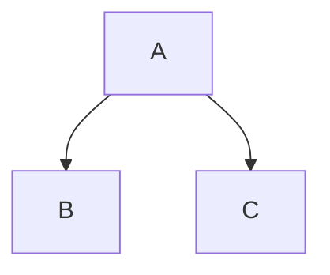

## Code Block

```js
console.log('Hello World');
```

## Mermaid (as component)

<Mermaid
  chart="
graph TD;
  A[Start]-->B{Choice};
  B -- Yes --> C[Do thing];
  B -- No --> D[Do other];
  C --> E[End];
  D --> E[End];
"
/>

## Mermaid (as code block)



## Cards

<Cards>
  <Card title="Learn more about Next.js" href="https://nextjs.org/docs" />
  <Card title="Learn more about Fumadocs" href="https://fumadocs.vercel.app" />
</Cards>
