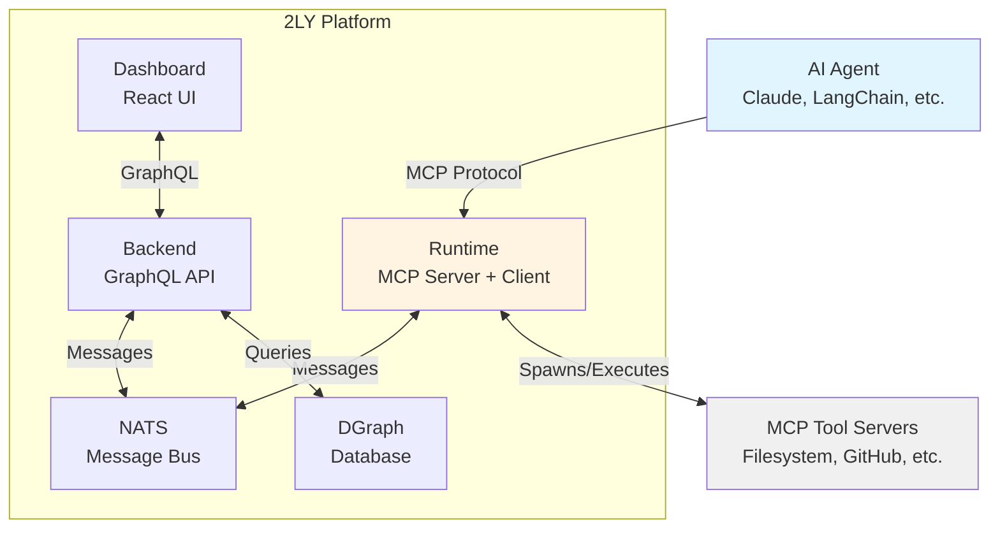

2LY connects AI agents to tools via MCP using NATS messaging, DGraph storage, and distributed runtimes.

## Quick Architecture

## Core Components

### Agents
AI systems that connect via MCP protocol:
- Claude Desktop
- LangChain/LangGraph applications
- Custom Python/TypeScript agents
- n8n workflows

**Role:** Request and invoke tools for task execution

### Runtime
Distributed execution environment (`@2ly/runtime`):
- **Agent Mode**: Acts as MCP server for agents
- **Tool Mode**: Spawns and manages MCP tool servers
- **Deployment**: Local, cloud, or edge

**Role:** Bridge between agents and tools via NATS

### Backend
Central orchestration service:
- **GraphQL API**: Manage workspaces, runtimes, tools
- **Runtime Coordination**: Track runtime health and route messages
- **Tool Discovery**: Aggregate tool capabilities

**Role:** Coordinate distributed components and persist configuration

### NATS
Message bus for all communication:
- **Pub/Sub**: Real-time updates
- **Request/Reply**: Tool execution
- **KV Store**: Heartbeat and config

**Role:** Enable decoupled, scalable communication

### DGraph
Graph database for platform data:
- Workspaces and users
- Runtimes and their configurations
- MCP servers and discovered tools
- Tool capabilities and assignments

**Role:** Persist and query platform state

### Dashboard
React-based management interface:
- Monitor runtime health
- Configure MCP servers
- Assign tool capabilities
- View tool execution

**Role:** User interface for platform management

## How It Works

1. **Agent connects** to runtime via MCP
2. **Runtime registers** with backend via NATS
3. **Tools are discovered** and sent to agent
4. **Agent calls tool** → NATS routes to tool runtime → executes → returns result

## Deployment

**Local:** All components on localhost via Docker Compose
**Production:** Distributed with backend cluster, global runtimes, edge runtimes
**Hybrid:** Cloud backend + edge runtimes

## Next Steps

- [Your First Toolflow](/your-first-toolflow/overview) - Build first workflow
- [Detailed Architecture](/deep-dive/architecture-detailed) - Full technical deep-dive