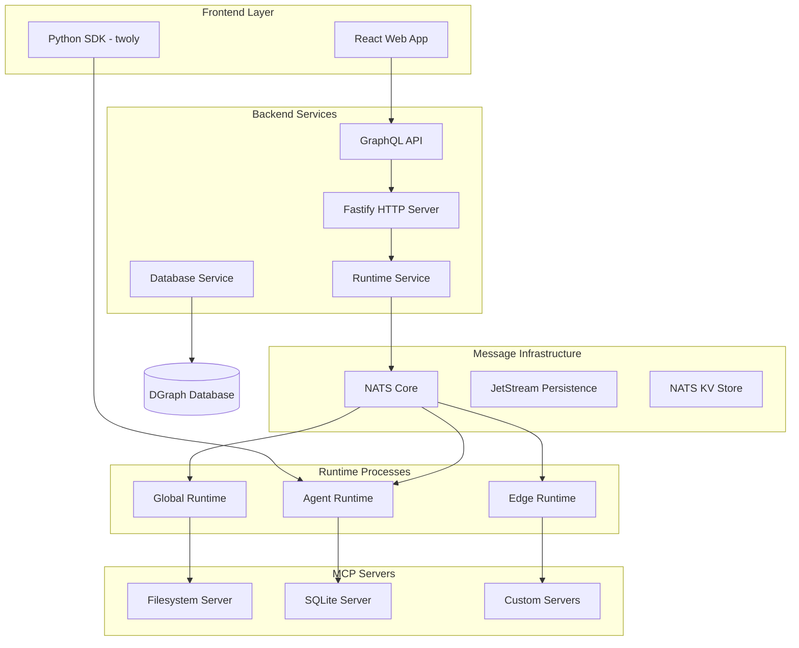

2LY implements a distributed, message-driven architecture for AI tool orchestration. The platform connects AI agents to MCP (Model Context Protocol) tools through distributed runtimes, using NATS messaging for communication and DGraph for persistence.

## Core Architecture

2LY follows a layered architecture pattern with distributed components:

- **Client Layer**: React web interface and Python SDK for agent integration
- **Backend Services**: GraphQL API and orchestration logic
- **Message Layer**: NATS messaging with JetStream persistence
- **Runtime Layer**: Distributed MCP server execution environments
- **Infrastructure**: DGraph database and containerized services

## System Components

### Backend Service Layer

Central orchestration and API services:



**Technology Stack**:
- **Fastify**: High-performance HTTP server
- **Apollo GraphQL**: API layer with real-time subscriptions
- **TypeScript**: Type-safe development across services
- **NATS**: Message broker with clustering support

### Runtime Management

Distributed runtime processes for tool execution:

```typescript
// Runtime architecture
interface RuntimeInstance {
  runtimeId: string;
  type: 'GLOBAL' | 'AGENT' | 'EDGE';
  capabilities: string[];
  mcpServers: MCPServerConfig[];
  status: 'connected' | 'disconnected' | 'healthy';
}

// Runtime service orchestration
class RuntimeService {
  private runtimeInstances = new Map<string, RuntimeInstance>();
  
  async registerRuntime(config: RuntimeConfig): Promise<void> {
    // Runtime registration and heartbeat monitoring
  }
  
  async distributeToolCall(call: ToolCall): Promise<ToolResult> {
    // Route tool calls to appropriate runtime
  }
}
```

**Runtime Types**:
- **Global Runtime**: Centralized tool execution for shared services
- **Agent Runtime**: Agent-specific tool execution environments
- **Edge Runtime**: Distributed execution for latency-sensitive operations

### Message Architecture

NATS-based messaging for distributed coordination:

```typescript
// Message routing patterns
interface MessageRouter {
  'runtime.connect': RuntimeConnectMessage;
  'runtime.heartbeat': HeartbeatMessage;
  'agent.tool.call': AgentCallMCPToolMessage;
  'tool.call.response': AgentCallResponseMessage;
  'mcp.server.update': UpdateConfiguredMCPServerMessage;
  'capabilities.update': SetRuntimeCapabilitiesMessage;
}

// Runtime communication pattern
class RuntimeCommunication {
  async publishToRuntime<T>(subject: string, message: T): Promise<void> {
    await this.natsService.publish(`runtime.${subject}`, message);
  }
  
  subscribeToRuntimeEvents<T>(pattern: string): Observable<T> {
    return this.natsService.subscribe(pattern);
  }
}
```

**Message Flow Patterns**:
- **Runtime Registration**: Runtimes announce capabilities to backend
- **Tool Discovery**: Backend publishes available tools to runtimes
- **Execution Requests**: Agents request tool execution via message routing
- **Result Delivery**: Tool results returned through message correlation

### Data Persistence

DGraph database for GraphQL-native data management:

```typescript
// Data architecture
interface DataModel {
  Runtime: {
    id: string;
    name: string;
    status: RuntimeStatus;
    capabilities: Capability[];
    mcpServers: MCPServer[];
  };
  
  MCPServer: {
    id: string;
    name: string;
    runOn: 'GLOBAL' | 'AGENT' | 'EDGE';
    configuration: ServerConfig;
    tools: MCPTool[];
  };
  
  Workspace: {
    id: string;
    name: string;
    runtimes: Runtime[];
    users: User[];
  };
}

// Repository pattern for data access
class RuntimeRepository {
  async getRuntimeById(id: string): Promise<Runtime> {
    return this.dgraphClient.query(GET_RUNTIME_BY_ID, { id });
  }
  
  subscribeToRuntimeUpdates(): Observable<Runtime[]> {
    return this.dgraphClient.subscription(RUNTIME_SUBSCRIPTION);
  }
}
```

**Database Features**:
- **GraphQL Schema**: Native GraphQL query and mutation support
- **Real-time Subscriptions**: Live updates for runtime status changes
- **ACID Transactions**: Consistent data operations
- **Distributed Architecture**: Horizontal scaling capabilities

## Integration Interfaces

### Agent Integration SDK

Python SDK for connecting AI agents to 2LY:

```python
from twoly import TwolyMCP

# Agent connection with runtime binding
async def create_agent_with_tools():
    async with TwolyMCP("my-agent") as mcp:
        # Runtime automatically assigns agent to appropriate runtime
        tools = await mcp.get_langchain_tools()
        
        # Tools are MCP-compatible and framework-agnostic
        agent = create_agent(llm=your_llm, tools=tools)
        return agent

# Advanced runtime targeting
async def create_edge_agent():
    config = MCPConfig(
        runtime_preference="edge",
        tool_filter=["filesystem", "database"]
    )
    
    async with TwolyMCP("edge-agent", config=config) as mcp:
        tools = await mcp.get_langchain_tools()
        return create_agent(llm=your_llm, tools=tools)
```

### Web Interface

React-based management interface:

- **Runtime Dashboard**: Real-time monitoring of distributed runtimes
- **Tool Registry**: MCP server configuration and deployment
- **Agent Management**: Agent registration and tool binding
- **System Monitoring**: Health checks and performance metrics

## Execution Patterns

### Tool Execution Flow

End-to-end tool execution through distributed architecture:

```typescript
// Tool execution sequence
interface ToolExecutionFlow {
  // 1. Agent discovers available tools
  agentDiscovery: {
    agent: "my-agent";
    runtime: "agent-runtime";
    tools: MCPTool[];
  };
  
  // 2. Agent invokes tool
  toolInvocation: {
    toolName: "filesystem_read";
    parameters: { path: "/data/file.txt" };
    correlationId: string;
  };
  
  // 3. Runtime routes to appropriate MCP server
  runtimeRouting: {
    targetRuntime: "edge-runtime";
    mcpServer: "filesystem-server";
    executionContext: ExecutionContext;
  };
  
  // 4. Result returned through message correlation
  resultDelivery: {
    correlationId: string;
    result: ToolResult;
    executionTime: number;
    status: "success" | "error";
  };
}
```

### Runtime Communication

Distributed runtime coordination patterns:

```typescript
// Runtime lifecycle management
class RuntimeLifecycle {
  async onRuntimeConnect(runtime: RuntimeInstance): Promise<void> {
    // Register runtime capabilities
    await this.registerCapabilities(runtime);
    
    // Assign MCP servers based on runOn configuration
    await this.assignMCPServers(runtime);
    
    // Start heartbeat monitoring
    this.startHeartbeatMonitoring(runtime);
  }
  
  async routeToolCall(call: ToolCall): Promise<RuntimeInstance> {
    // Select optimal runtime based on:
    // - Tool requirements
    // - Runtime capabilities
    // - Load balancing
    // - Latency considerations
    return this.selectOptimalRuntime(call);
  }
}
```

## Deployment Architecture

### Container Orchestration

Docker-based deployment with service isolation:

```yaml
# Production deployment configuration
services:
  backend:
    image: 2ly/backend:latest
    environment:
      - NATS_SERVERS=nats://nats-cluster:4222
      - DGRAPH_ENDPOINT=http://dgraph-alpha:8080
      - RUNTIME_SERVICE_DISCOVERY=true
    depends_on: [nats, dgraph]
  
  runtime-global:
    image: 2ly/runtime:latest
    environment:
      - RUNTIME_TYPE=GLOBAL
      - GLOBAL_RUNTIME=true
      - MCP_SERVER_AUTO_DISCOVERY=true
    volumes:
      - ./mcp-servers:/app/servers
  
  runtime-edge:
    image: 2ly/runtime:latest
    environment:
      - RUNTIME_TYPE=EDGE
      - EDGE_OPTIMIZATION=true
      - LATENCY_SENSITIVE_TOOLS=true
    deploy:
      replicas: 3
  
  nats:
    image: nats:jetstream
    command: [
      "--jetstream",
      "--cluster_name", "2ly-cluster",
      "--store_dir", "/data"
    ]
    volumes:
      - nats-data:/data
```

### Runtime Distribution

Flexible runtime deployment patterns:

```typescript
// Runtime deployment strategies
interface RuntimeDeployment {
  global: {
    purpose: "Centralized tool execution";
    deployment: "Single instance with high availability";
    mcpServers: "Shared services and databases";
  };
  
  agent: {
    purpose: "Agent-specific tool isolation";
    deployment: "Per-agent or per-workspace";
    mcpServers: "Agent-scoped tools and data";
  };
  
  edge: {
    purpose: "Distributed execution";
    deployment: "Regional or proximity-based";
    mcpServers: "Latency-sensitive operations";
  };
}
```

## Design Principles

### MCP Protocol Integration

Standardized tool interface through Model Context Protocol:

```typescript
// MCP server lifecycle management
class MCPServerManager {
  async deployServer(config: MCPServerConfig): Promise<MCPServerInstance> {
    // Deploy server to appropriate runtime based on runOn configuration
    const runtime = this.selectRuntime(config.runOn);
    return runtime.deployMCPServer(config);
  }
  
  async discoverCapabilities(server: MCPServerInstance): Promise<Capability[]> {
    // Standard MCP capability discovery
    return server.listCapabilities();
  }
  
  async executeToolCall(call: ToolCall): Promise<ToolResult> {
    // Route through appropriate runtime and MCP server
    const server = this.findServerForTool(call.toolName);
    return server.executeTool(call);
  }
}
```

**MCP Benefits**:
- **Standardization**: Industry-standard protocol for AI tool integration
- **Interoperability**: Compatible with LangChain, LangFlow, and other frameworks
- **Community Ecosystem**: Access to growing MCP server catalog
- **Future-Proof**: Designed for long-term AI tool compatibility

### Distributed Architecture

Scalable, fault-tolerant system design:

- **Horizontal Scaling**: Runtime processes scale independently
- **Fault Isolation**: Runtime failures don't affect other components
- **Load Distribution**: Intelligent routing based on capabilities and load
- **Geographic Distribution**: Edge runtimes for reduced latency

## Operations

### System Monitoring

Comprehensive observability across distributed components:

- **Runtime Health**: Heartbeat monitoring and status tracking
- **Message Flow**: NATS message tracing and correlation
- **Tool Performance**: Execution times and success rates
- **Resource Utilization**: CPU, memory, and network usage

### Troubleshooting

**Architecture Issues**:

*Runtime Connectivity*:
- Verify NATS cluster connectivity and authentication
- Check runtime registration and heartbeat messages
- Validate MCP server deployment and discovery

*Message Flow Problems*:
- Trace message correlation IDs through system
- Monitor NATS JetStream persistence and delivery
- Check runtime load balancing and tool routing

*Performance Bottlenecks*:
- Analyze runtime distribution and load patterns
- Profile MCP server execution and response times
- Optimize message routing and runtime selection

### Best Practices

**System Design**:
- Implement proper runtime isolation and resource limits
- Use message correlation for distributed tracing
- Design for eventual consistency in distributed operations

**Deployment**:
- Deploy multiple runtime instances for high availability
- Use appropriate runtime types (GLOBAL/AGENT/EDGE) for use cases
- Implement proper monitoring and alerting for production systems

**Development**:
- Follow MCP protocol standards for custom server development
- Use TypeScript for type safety across distributed services
- Implement comprehensive error handling and retry logic

## Next Steps

1. **[Agent-Tool Patterns](/technical-concepts/agent-tool-patterns)** - Learn interaction patterns
2. **[System Lifecycle](/technical-concepts/lifecycle)** - Understand component lifecycles
3. **[Runtime Deployment](/runtime-deployment/runtime)** - Deploy production systems
4. **[Security Architecture](/runtime-deployment/security)** - Implement security controls

## Summary

2LY architecture provides:
- **Distributed Execution**: Scalable runtime orchestration with NATS messaging
- **MCP Integration**: Standard protocol for AI tool interoperability
- **Flexible Deployment**: Support for global, agent, and edge runtime patterns
- **Real-time Operations**: GraphQL subscriptions and live system monitoring
- **Enterprise Scalability**: Container orchestration and horizontal scaling

The architecture enables reliable, scalable AI tool orchestration across distributed environments.