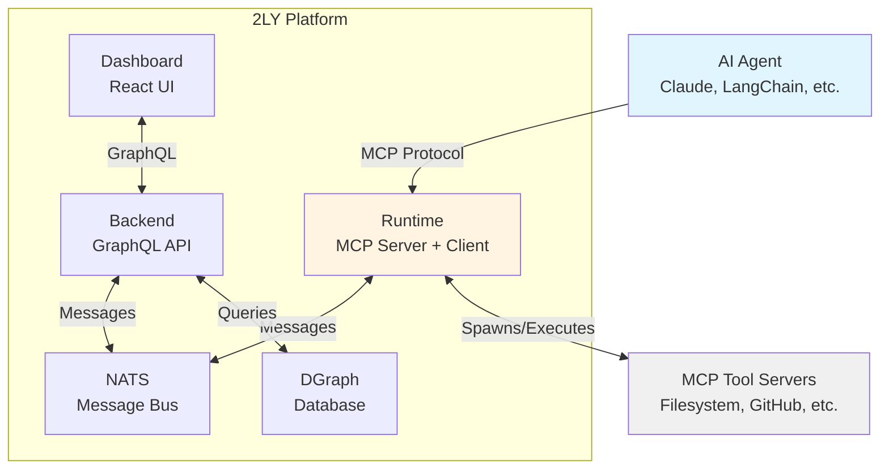
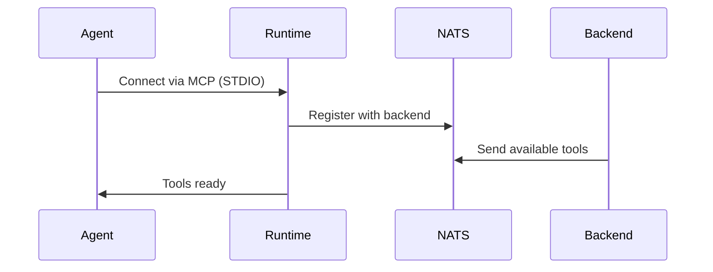
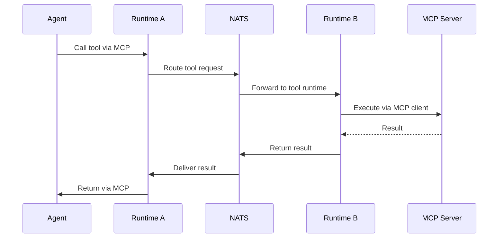

2LY is a distributed platform that connects AI agents to tools via the MCP (Model Context Protocol). It uses NATS for messaging, DGraph for data storage, and distributed runtimes for tool execution.

## Quick Architecture

## Core Components

### Agents
AI systems that connect via MCP protocol:
- Claude Desktop
- LangChain/LangGraph applications
- Custom Python/TypeScript agents
- n8n workflows

**Role:** Request and invoke tools for task execution

### Runtime
Distributed execution environment (`@2ly/runtime`):
- **Agent Mode**: Acts as MCP server for agents
- **Tool Mode**: Spawns and manages MCP tool servers
- **Deployment**: Local, cloud, or edge

**Role:** Bridge between agents and tools via NATS

### Backend
Central orchestration service:
- **GraphQL API**: Manage workspaces, runtimes, tools
- **Runtime Coordination**: Track runtime health and route messages
- **Tool Discovery**: Aggregate tool capabilities

**Role:** Coordinate distributed components and persist configuration

### NATS
Message bus for all communication:
- **Pub/Sub**: Real-time updates
- **Request/Reply**: Tool execution
- **KV Store**: Heartbeat and config

**Role:** Enable decoupled, scalable communication

### DGraph
Graph database for platform data:
- Workspaces and users
- Runtimes and their configurations
- MCP servers and discovered tools
- Tool capabilities and assignments

**Role:** Persist and query platform state

### Dashboard
React-based management interface:
- Monitor runtime health
- Configure MCP servers
- Assign tool capabilities
- View tool execution

**Role:** User interface for platform management

## How It Works

### 1. Agent Connects

**What happens:**
- Agent spawns runtime as subprocess
- Runtime registers with backend via NATS
- Backend sends list of available tools
- Agent can now call tools

### 2. Tool Execution

**What happens:**
- Agent calls tool through its runtime
- Message routed via NATS to runtime with tool
- Tool executes on MCP server
- Result flows back through NATS to agent

### 3. Real-Time Updates

The dashboard receives live updates via GraphQL subscriptions:
- Runtime connect/disconnect
- Tool availability changes
- MCP server status updates

## Deployment Patterns

### Local Development
All components run on localhost via Docker Compose:
- Backend, NATS, DGraph in containers
- Runtime processes for tools
- Agent connects to local runtime

### Production
Distributed deployment:
- Backend cluster with NATS
- Global runtime for shared tools
- Edge runtimes on user machines
- Agents connect remotely

### Hybrid
Mix of deployment modes:
- Backend and global tools in cloud
- Edge runtimes on user machines
- Agents run wherever needed

## Key Design Principles

### Distributed by Design
- Components can run anywhere
- NATS enables remote communication
- No single point of failure (with clustering)

### MCP-First
- Standard protocol for tool integration
- Works with any MCP-compatible agent
- Access to growing MCP ecosystem

### Workspace Isolation
- Multi-tenant by design
- Resources scoped to workspace
- Users have workspace-level permissions

### Real-Time
- Observable pattern for updates
- GraphQL subscriptions for UI
- Immediate status changes

## Component Details

For in-depth information on each component:

- **[NATS Messaging](/technical-concepts/nats-messaging)** - Message bus and communication patterns
- **[Database Schema](/technical-concepts/database-schema)** - DGraph data models
- **[Runtime Implementation](/technical-concepts/runtime-implementation)** - Runtime architecture
- **[Tool Routing](/technical-concepts/tool-routing)** - How tool calls are routed
- **[GraphQL API](/api-reference/graphql-api)** - Complete API reference

## System Boundaries

**What 2LY Manages:**
- Runtime lifecycle and coordination
- MCP server configuration and spawning
- Tool discovery and capability assignment
- Message routing between components

**What 2LY Doesn't Manage:**
- Agent implementation (bring your own)
- LLM provider (OpenAI, Anthropic, etc.)
- MCP tool server implementation (uses community servers)
- Application logic (stays in your agent)

## Scalability

**Horizontal Scaling:**
- Backend instances (share NATS and DGraph)
- Runtime instances (unlimited per workspace)
- NATS clustering for high availability

**Vertical Scaling:**
- DGraph for larger datasets
- Runtime resource limits per MCP server
- NATS message throughput

**Current Limits:**
- ~10-20 MCP servers per runtime (subprocess limit)
- ~100-500 concurrent tool calls (runtime-dependent)
- No hard limit on workspaces or users

## Next Steps

**Quick Start:**
- [Installation](/getting-started/installation) - Get 2LY running locally
- [Your First Toolflow](/your-first-toolflow/overview) - Create your first agent-tool workflow

**Deep Dives:**
- [Technical Architecture](/technical-concepts/architecture) - Detailed system design
- [Agent-Tool Patterns](/technical-concepts/agent-tool-patterns) - Integration patterns
- [Lifecycle](/technical-concepts/lifecycle) - Component lifecycles