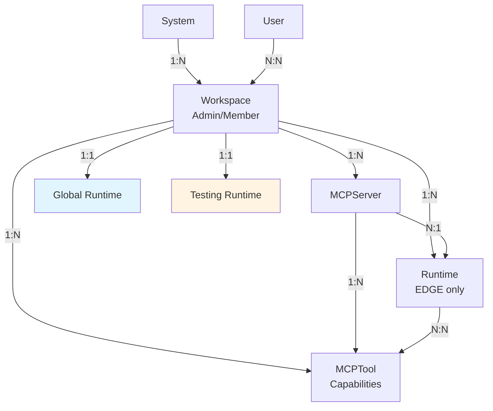

2LY uses DGraph, a GraphQL-native graph database, for storing platform data. The schema defines workspaces, runtimes, MCP servers, tools, and their relationships.

## Core Entities

### System
The singleton representing the 2LY instance:

```graphql
type System {
  id: ID!
  initialized: Boolean!
  workspaces: [Workspace!]
  defaultWorkspace: Workspace
  admins: [User!]
  createdAt: DateTime!
  updatedAt: DateTime!
}
```

- Auto-created on first startup
- Contains default workspace and admin user
- Single instance per deployment

### Workspace
Multi-tenancy unit for isolation:

```graphql
type Workspace {
  id: ID!
  name: String!
  mcpServers: [MCPServer!]
  mcpTools: [MCPTool!]
  runtimes: [Runtime!]
  admins: [User!]
  users: [User!]
  globalRuntime: Runtime
  defaultTestingRuntime: Runtime
  createdAt: DateTime!
}
```

**Key Relationships:**
- Contains all runtimes, MCP servers, and tools
- Has special references to global and testing runtimes
- Isolates resources between workspaces

### Runtime
Execution environment for tools and agents:

```graphql
type Runtime {
  id: ID!
  name: String!
  description: String
  status: ActiveStatus!         # ACTIVE | INACTIVE
  capabilities: [String!]       # ["agent", "tool"]
  roots: String                 # JSON: filesystem access
  processId: String             # PID for RID generation
  hostname: String
  hostIP: String
  mcpClientName: String         # e.g., "Claude Desktop"
  lastSeenAt: DateTime
  mcpToolCapabilities: [MCPTool!]   # Tools this runtime can execute
  mcpServers: [MCPServer!]          # EDGE servers for this runtime
  workspace: Workspace!
  createdAt: DateTime!
}
```

**Runtime Identity (RID):**
- Format: `{id}-{processId}`
- Allows multiple processes with same name
- Used for NATS subject routing

**Capabilities:**
- `agent`: Can act as MCP server for agents
- `tool`: Can execute tools from MCP servers

### MCPServer
Configuration for spawning MCP tool servers:

```graphql
type MCPServer {
  id: ID!
  name: String!
  description: String!
  repositoryUrl: String!
  transport: MCPTransportType!  # STDIO | STREAM
  command: String!              # e.g., "npx"
  args: String!                 # Space-separated args
  ENV: String!                  # Newline-separated KEY=VALUE
  serverUrl: String             # For STREAM transport
  headers: String               # For STREAM transport
  runOn: MCPServerRunOn         # GLOBAL | AGENT | EDGE
  tools: [MCPTool!]             # Discovered tools
  runtime: Runtime              # For EDGE type
  workspace: Workspace!
}
```

**RunOn Types:**
- **GLOBAL**: Runs on workspace's global runtime (shared tools)
- **AGENT**: Runs on agent's runtime (agent-specific)
- **EDGE**: Runs on specific runtime (user-specific)

### MCPTool
Auto-discovered tool from MCP servers:

```graphql
type MCPTool {
  id: ID!
  name: String!
  description: String!
  inputSchema: String!       # JSON Schema
  annotations: String!       # MCP annotations
  status: ActiveStatus!      # ACTIVE | INACTIVE
  lastSeenAt: DateTime!
  mcpServer: MCPServer!
  runtimes: [Runtime!]       # Runtimes with capability to execute
  workspace: Workspace!
  createdAt: DateTime!
}
```

**Lifecycle:**
- Discovered when MCP server spawns
- Status updated based on availability
- `lastSeenAt` tracks recent availability

### User
Authentication and authorization:

```graphql
type User {
  id: ID!
  login: String!
  password: String!          # bcrypt hashed
  adminOfWorkspaces: [Workspace!]
  membersOfWorkspaces: [Workspace!]
  createdAt: DateTime!
  updatedAt: DateTime!
}
```

## Entity Relationships



## Key Patterns

### Workspace Isolation
All entities are scoped to a workspace:
- Runtimes see only workspace's tools
- MCP servers isolated per workspace
- Users have workspace-level permissions

### Runtime-Tool Relationship
The `mcpToolCapabilities` edge defines which tools a runtime can execute:

```
Runtime --[mcpToolCapabilities]--> MCPTool
```

This is used for:
- Agent capability assignment (which tools an agent sees)
- Tool routing (which runtime executes a tool)

### MCP Server Deployment
Three deployment patterns based on `runOn`:

1. **GLOBAL**: `MCPServer` → `Workspace.globalRuntime`
2. **AGENT**: `MCPServer` spawns on agent's runtime (no DB link)
3. **EDGE**: `MCPServer` → specific `Runtime` (via `runtime` field)

## Data Lifecycle

### Runtime Lifecycle
1. **Registration**: Runtime connects → Backend creates/updates Runtime entity
2. **Heartbeat**: Runtime publishes heartbeat → Backend updates `lastSeenAt`
3. **Timeout**: No heartbeat for >30s → Backend sets `status = INACTIVE`
4. **Disconnect**: Runtime stops → Status remains INACTIVE

### Tool Lifecycle
1. **Discovery**: MCP server spawns → Lists tools → Runtime publishes to backend
2. **Upsert**: Backend creates or updates MCPTool entities
3. **Status**: Tools marked ACTIVE when seen, INACTIVE when not
4. **Tracking**: `lastSeenAt` updated on each discovery cycle

### MCP Server Lifecycle
1. **Configuration**: User creates MCPServer via GraphQL
2. **Propagation**: Backend publishes config to appropriate runtime(s)
3. **Spawn**: Runtime receives config → Spawns MCP server subprocess
4. **Discovery**: Tools discovered and published back
5. **Update**: Config changes trigger respawn

## Queries & Mutations

**Key Queries:**
```graphql
# Get workspace with all resources
query {
  workspace {
    runtimes { name status }
    mcpServers { name runOn }
    mcpTools { name status }
  }
}

# Get runtime with capabilities
query {
  runtime(id: "...") {
    mcpToolCapabilities { name }
    mcpServers { name }
  }
}
```

**Key Mutations:**
```graphql
# Create MCP server
mutation {
  createMCPServer(
    workspaceId: "..."
    name: "Filesystem"
    command: "npx"
    args: "@modelcontextprotocol/server-filesystem /tmp"
    runOn: GLOBAL
  ) { id }
}

# Assign tool to runtime (capability)
mutation {
  linkMCPToolToRuntime(
    mcpToolId: "..."
    runtimeId: "..."
  ) { id }
}
```

## Search & Indexing

DGraph provides full-text search on:
- Runtime names
- MCP server names
- Tool names and descriptions
- User logins

Search syntax:
```graphql
query {
  queryRuntime(filter: { name: { allofterms: "agent" } }) {
    name status
  }
}
```

## Performance Considerations

**Workspace Queries:**
- Always filter by workspaceId to use indices
- Avoid N+1 queries by fetching relationships in single query

**Runtime Queries:**
- `status = ACTIVE` filter is common - ensure indexed
- `lastSeenAt` used for sorting - indexed

**Tool Queries:**
- Tools frequently joined with mcpServer and runtimes
- Use GraphQL batching for tool capabilities

## Best Practices

**For Backend Developers:**
- Always scope queries to workspace
- Use DGraph transactions for multi-entity updates
- Leverage GraphQL subscriptions for real-time updates
- Index frequently queried fields

**For Frontend Developers:**
- Use GraphQL subscriptions for live data
- Batch tool capability queries
- Cache workspace data (changes infrequently)

## Next Steps

- [NATS Messaging](/technical-concepts/nats-messaging) - How data flows between services
- [Tool Routing](/technical-concepts/tool-routing) - How mcpToolCapabilities is used
- [Architecture Overview](/technical-concepts/architecture-overview) - Full system architecture