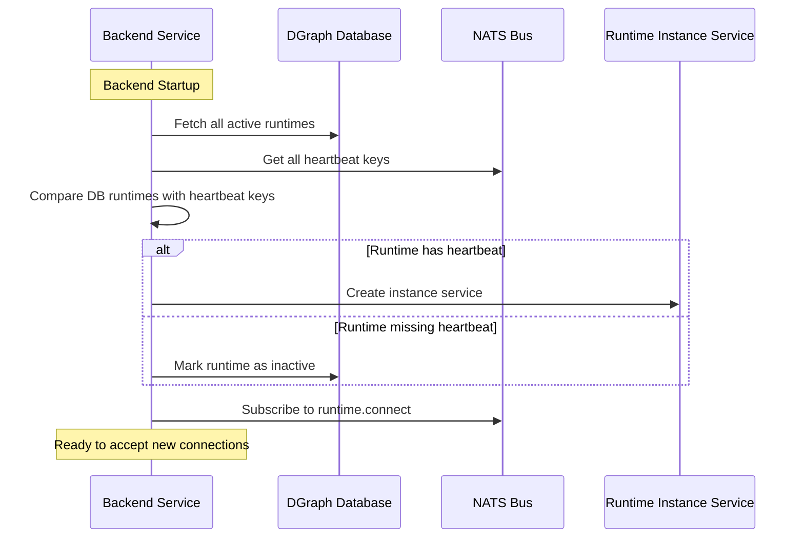
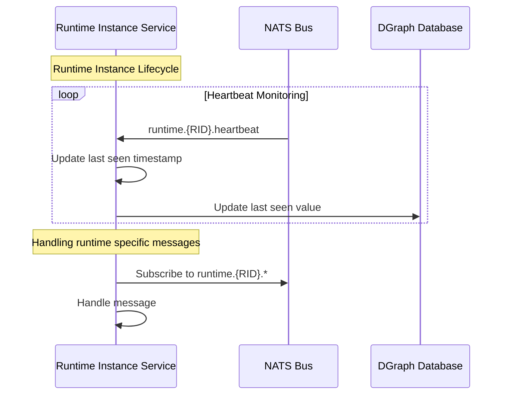
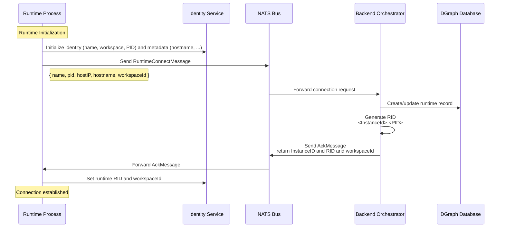
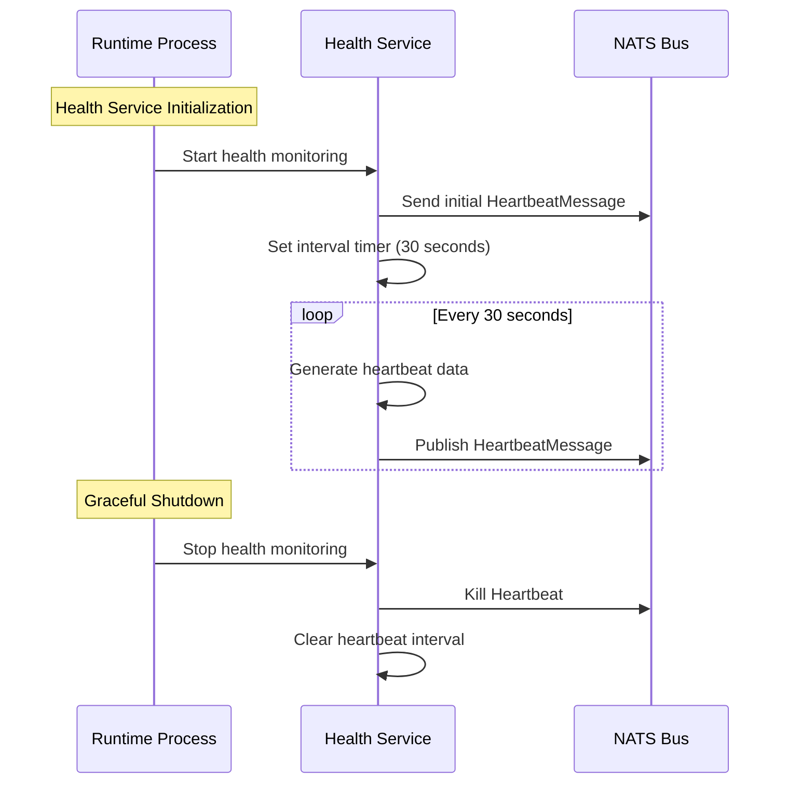
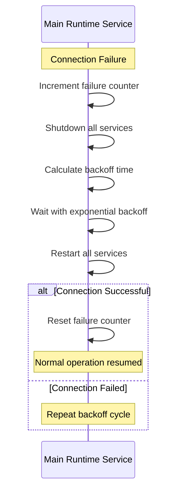
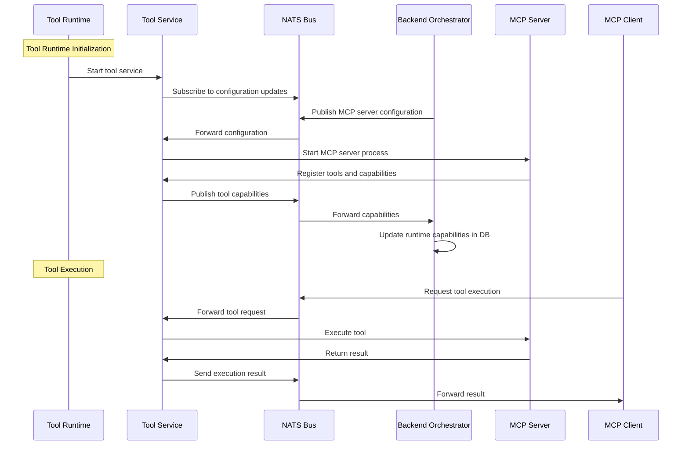
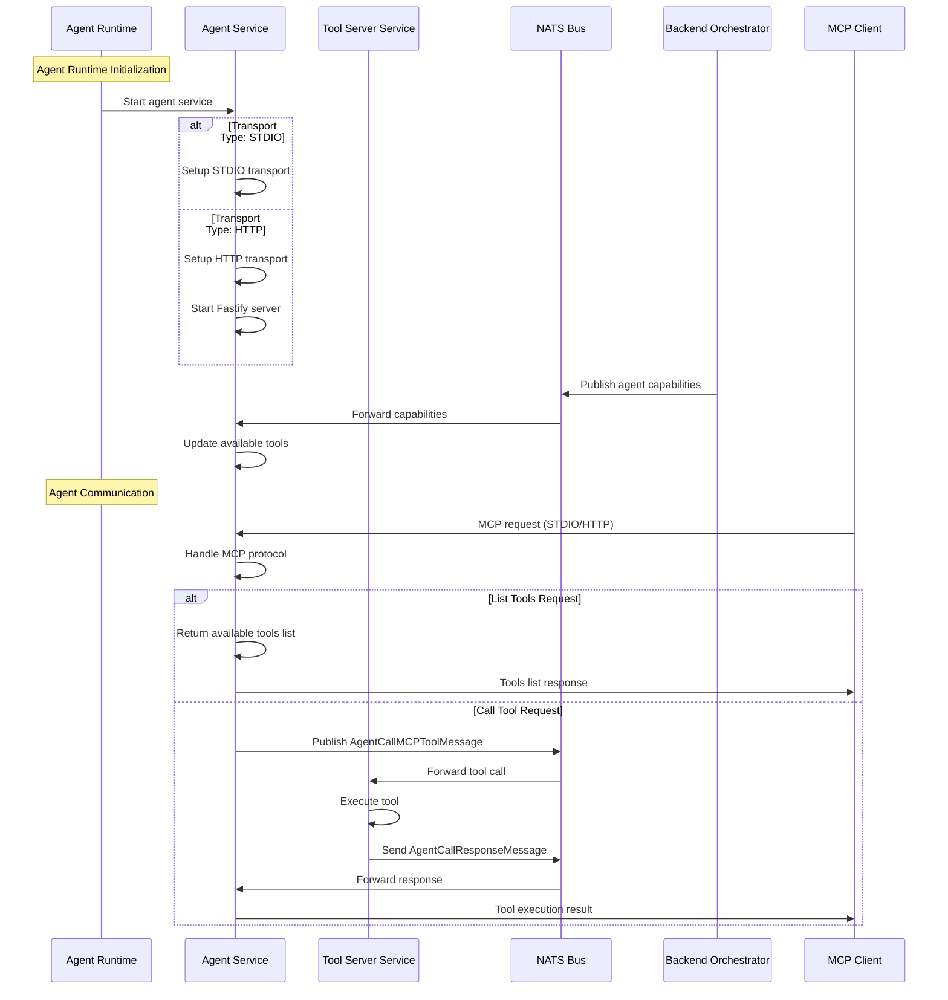

## Overview

2ly operates as a distributed system where the backend orchestrator manages multiple runtime instances that can act as either Tool Runtimes or Agent Runtimes. The system uses NATS as a message bus for communication and DGraph as the persistent data store.

The lifecycle consists of five main stages:

1. **Initialization** - Backend starts and rehydrates existing runtimes
2. **Registration** - Runtimes connect to the backend and establish identity
3. **Health & Heartbeats** - Continuous monitoring and health checking
4. **Execution** - Runtime capabilities and MCP server management
5. **Teardown** - Graceful shutdown and cleanup

## Backend Lifecycle

The backend orchestrator is responsible for managing runtime instances, maintaining their state, and coordinating communication between different system components.

### Initialization and Rehydration

When the backend starts, it performs a rehydration process to restore the state of previously active runtimes:

### Runtime Instance Service

Each runtime instance is managed by a dedicated service that handles:

- **Heartbeat Monitoring**: Subscribe to instance heartbeat and disconnect when heartbeat is gone
- **Message Handling**: Processes runtime-specific messages and commands
- **Capability Updates**: Manages MCP server configurations and tool capabilities
- **Graceful Shutdown**: Handles runtime disconnection and cleanup

Runtime specific messages includes

* **Set Capabilities**: Set the capabilities (`tool`, `agent`) of the Runtime
* **Set Roots**: Set the roots available for a runtime acting as MCP Client (spwaning MCP Servers)
* **Set Default Testing Runtime**: set this runtime as the default one for testing MCP Servers in workpace
* **Set Global Runtime**: set the runtime as the global one for the workspace

## Runtime Lifecycle

Runtime instances can have multiple capabilities:

* **tool**: (default: true) When a Runtime has the tool capabilities it means that it can host tool execution such as spawing MCP Servers and call their tools in response to a Tool Call on the bus
* **agent**: (default: auto) When a Runtime has the agent capabilities it means it can have Tool Capabilities linked to it and therefore will be able to provide these tools to an Agent when the runtime is executed as MCP Client.

### Connection and Registration

Runtimes establish their identity and capabilities during the connection process:

### Health Monitoring and Heartbeats

Runtimes maintain their connection through regular heartbeat messages:

### Reconnection Strategy

Runtimes implement an exponential backoff strategy for reconnection:

## Execution and Capability Management

### Tool Runtime Execution

Tool runtimes manage MCP servers and provide tool execution capabilities:

### Agent Runtime Execution

Agent runtimes provide MCP server capabilities for agent communication:

## Teardown and Cleanup

### Graceful Shutdown Process

Both runtimes and the backend implement graceful shutdown procedures which stops the services and avoid memory leaks.

- **Runtime processes** announce their disconnection by killing their heartbeat, which is then picked-up by the backend in order to mark runtime as inactive
- **Backend process** do not announce its disconnection has it should have an auto-restart mechanism in place and is able to re-hydrate runtimes at startup time