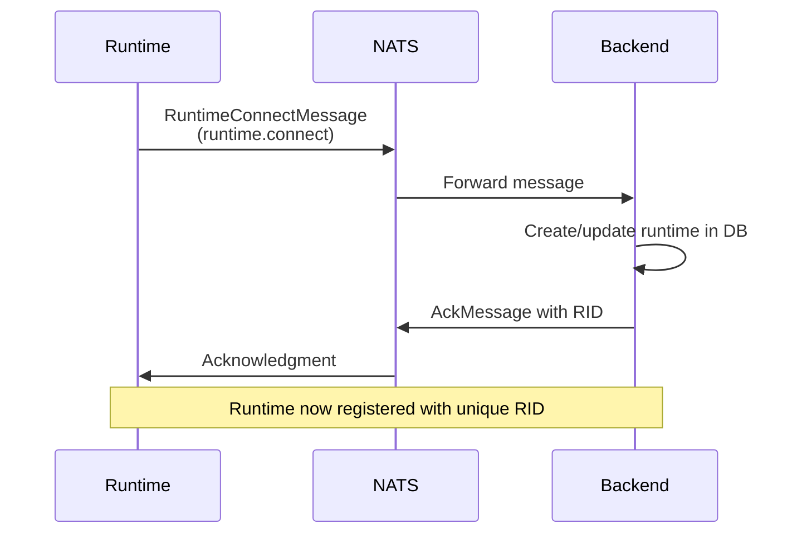
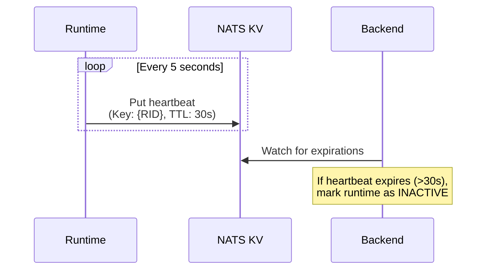
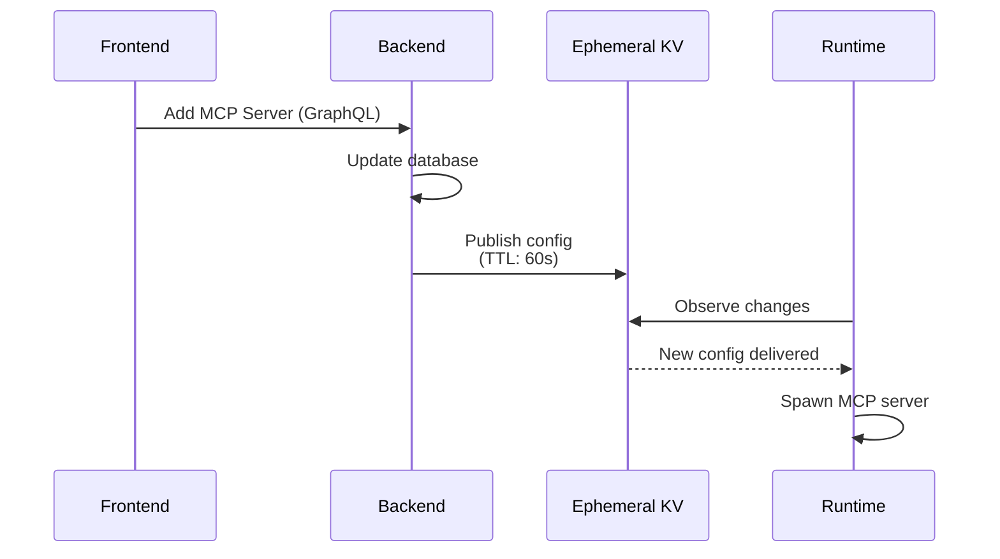
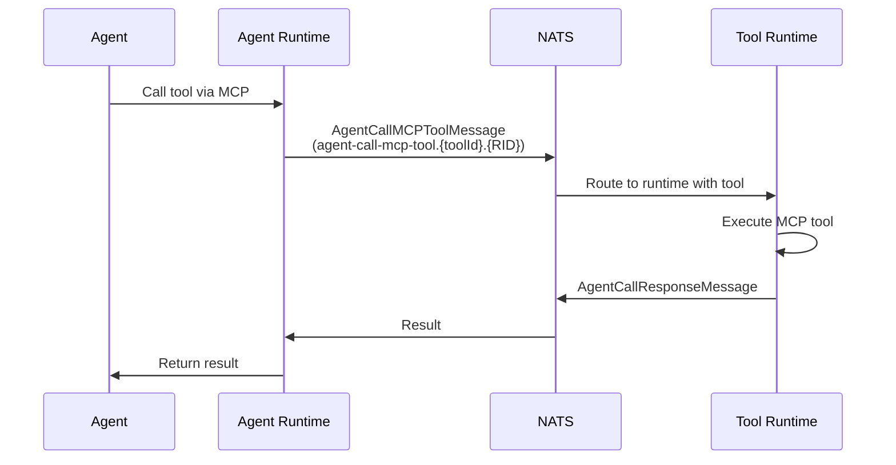

2LY uses NATS as its distributed message bus for all communication between components. This enables decoupled, scalable architecture where runtimes, backend, and agents communicate asynchronously.

## Why NATS?

NATS provides 2LY with:
- **Decoupled Communication**: Services don't need direct connections
- **Pub/Sub Patterns**: One-to-many messaging for updates
- **Request/Reply**: Synchronous request-response when needed
- **Persistence**: JetStream for guaranteed message delivery
- **Key-Value Store**: Ephemeral data with TTL for config and heartbeat

## NATS Components in 2LY

### Core Messaging
Standard NATS pub/sub for real-time communication between services.

### JetStream
Persistent messaging layer for:
- Guaranteed delivery of critical messages
- Message replay capability
- Stream-based data flow

### KV Stores
Two key-value stores with different TTLs:

**Heartbeat KV** (TTL: 30s)
- Stores runtime heartbeat timestamps
- Key format: `{RID}` (Runtime ID)
- Used for liveness detection

**Ephemeral KV** (TTL: 60s)
- Stores transient configuration data
- Used for config propagation to runtimes
- Avoids polling for updates

## Subject Naming Convention

NATS subjects follow a hierarchical pattern:

```
runtime.connect                                    # Runtime registration
runtime.{RID}.*                                    # Runtime-specific messages
runtime.{RID}.capabilities                         # Set runtime capabilities
runtime.{RID}.roots                                # Set filesystem roots
runtime.{RID}.global                               # Set global runtime flag
runtime.{RID}.testing                              # Set testing runtime flag

agent-call-mcp-tool.{toolId}.{fromRuntimeId}      # Tool execution request
agent-capabilities.{RID}                           # Tools available to agent
update-configured-mcp-server.{RID}                 # MCP server config updates
```

## Message Flow Patterns

### Runtime Registration



### Heartbeat Monitoring



### Config Propagation



### Tool Execution



## Key Message Types

### Runtime Management
- **RuntimeConnectMessage**: Register runtime with backend
- **HeartbeatMessage**: Keepalive signal in KV store
- **SetRuntimeCapabilitiesMessage**: Update agent/tool capabilities
- **SetRootsMessage**: Configure filesystem access

### Tool Configuration
- **UpdateConfiguredMCPServerMessage**: Publish MCP server configs to runtime
- **UpdateMcpToolsMessage**: Report discovered tools to backend
- **AgentCapabilitiesMessage**: List tools available to agent

### Tool Execution
- **AgentCallMCPToolMessage**: Agent requests tool execution
- **AgentCallResponseMessage**: Tool execution result

### System
- **AckMessage**: Generic acknowledgment
- **ErrorMessage**: Error reporting

## Observable Pattern

2LY uses RxJS observables for reactive message handling:

```typescript
// Subscribe to runtime connections
natsService.subscribe('runtime.connect').subscribe(msg => {
  if (msg instanceof RuntimeConnectMessage) {
    // Handle runtime registration
  }
});

// Observe ephemeral KV for config updates
natsService.observeEphemeral(subject).subscribe(msg => {
  // React to config changes
});
```

This push-based pattern eliminates polling and enables real-time updates throughout the system.

## Connection Configuration

Runtimes connect to NATS using the `NATS_SERVERS` environment variable:

```bash
# Single server
NATS_SERVERS=nats://localhost:4222

# Multiple servers (cluster)
NATS_SERVERS=nats://node1:4222,nats://node2:4222,nats://node3:4222
```

## Performance Characteristics

- **Message Latency**: ~10-20ms for routing overhead
- **Throughput**: NATS handles 1M+ messages/sec (not a bottleneck)
- **Heartbeat Interval**: 5s (prevents excessive traffic)
- **Heartbeat TTL**: 30s (allows for network hiccups)
- **Ephemeral TTL**: 60s (config stays cached briefly)

## Best Practices

**For Runtime Developers:**
- Always implement exponential backoff for reconnection
- Handle message deserialization errors gracefully
- Monitor heartbeat publishing success
- Log NATS connection state changes

**For Backend Developers:**
- Use observables for reactive message handling
- Set appropriate TTLs for KV data
- Correlate messages using runtime IDs
- Implement message retry logic for critical operations

## Troubleshooting

**Runtime won't connect:**
- Verify NATS_SERVERS is reachable
- Check firewall rules for port 4222
- Review NATS server logs

**Messages not arriving:**
- Check subject spelling
- Verify subscriptions are active
- Monitor NATS message queue depth

**Heartbeat timeouts:**
- Check network latency between runtime and NATS
- Verify runtime process is healthy
- Review NATS KV store status

## Next Steps

- [Database Schema](/technical-concepts/database-schema) - Understand data persistence
- [Runtime Implementation](/technical-concepts/runtime-implementation) - Deep dive into runtime services
- [Tool Routing](/technical-concepts/tool-routing) - Learn how tool calls are routed