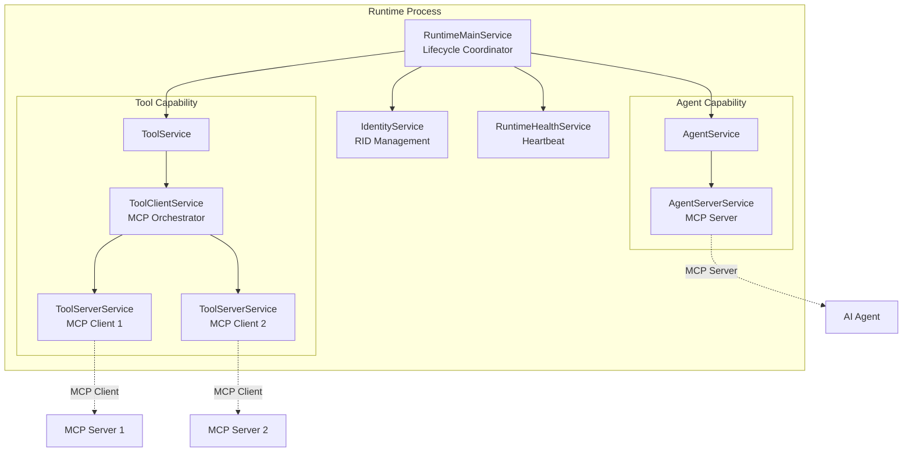

The 2LY runtime is a distributed execution environment that can act as both an MCP server (agent mode) and MCP client (tool mode). It's published as `@2ly/runtime` on npm.

## Runtime Identity

Each runtime has a unique Runtime ID (RID):

```
RID = {id}-{processId}
```

**Why include PID?**
- Allows multiple runtime processes with the same name
- Enables process-specific message routing
- Supports runtime restarts without ID conflicts

## Capability Model

Runtimes can operate in two modes simultaneously:

**Agent Capability** (`agent`)
- Runtime acts as MCP server for AI agents
- Exposes tools to agents via MCP protocol
- Handles tool execution requests from agents

**Tool Capability** (`tool`)
- Runtime spawns and manages MCP servers
- Executes tools from MCP servers
- Routes tool results back to agents

Configuration:
```bash
AGENT_CAPABILITY=true|false|auto    # Default: auto
TOOL_CAPABILITY=true|false          # Default: true
```

## Service Architecture

The runtime consists of several services working together:



### RuntimeMainService
Coordinates the entire runtime lifecycle:

**Responsibilities:**
- Connects to NATS backend
- Registers runtime identity
- Starts agent service (if enabled)
- Starts tool service (if enabled)
- Handles reconnection with exponential backoff
- Graceful shutdown

**Configuration:**
```bash
RUNTIME_NAME=my-runtime              # Required
WORKSPACE_ID=workspace-123           # Default: DEFAULT
NATS_SERVERS=nats://localhost:4222   # Default
```

### IdentityService
Manages runtime identification:

**RID Components:**
- `id`: UUID assigned by backend
- `processId`: Current process PID
- `name`: User-provided name
- `hostname`: Machine hostname
- `hostIP`: Machine IP address

### RuntimeHealthService
Publishes heartbeat to keep runtime alive:

**Heartbeat Pattern:**
- Publishes to NATS KV store every 5 seconds
- Key: `{RID}`
- Value: `{ timestamp: "..." }`
- TTL: 30 seconds
- Backend marks runtime INACTIVE if heartbeat expires

### AgentServerService (Agent Mode)
Implements MCP server protocol for agents:

**MCP Protocol Handlers:**
```typescript
// Initialize connection
server.setRequestHandler(InitializeRequestSchema, async () => {
  return {
    serverInfo: { name: "2ly", version: "1.0.0" },
    protocolVersion: "2024-11-05",
    capabilities: { tools: { listChanged: true } }
  };
});

// List available tools
server.setRequestHandler(ListToolsRequestSchema, async () => {
  return { tools: [...] };  // From AgentCapabilitiesMessage
});

// Execute tool
server.setRequestHandler(CallToolRequestSchema, async (request) => {
  // Route to backend via NATS
  const result = await natsService.request(
    new AgentCallMCPToolMessage(...)
  );
  return result;
});
```

**Transports:**
- **STDIO** (default): Standard input/output for local agents
- **STREAM**: HTTP-based for remote agents

Configuration:
```bash
AGENT_SERVER_TRANSPORT=stdio|stream     # Default: stdio
AGENT_SERVER_TRANSPORT_PORT=3001        # For stream transport
```

### ToolClientService (Tool Mode)
Orchestrates MCP server lifecycle:

**Responsibilities:**
- Observes MCP server configurations from backend (ephemeral KV)
- Spawns ToolServerService for each MCP server
- Stops servers when config removed
- Routes tool execution requests to appropriate server
- Publishes discovered tools to backend

**Config Observation:**
```typescript
// Watch ephemeral KV for config updates
natsService.observeEphemeral(subject).subscribe(msg => {
  if (msg instanceof UpdateConfiguredMCPServerMessage) {
    // Spawn or update MCP servers
  }
});
```

### ToolServerService (MCP Client)
Manages individual MCP server connection:

**Lifecycle:**
1. Spawn MCP server subprocess (STDIO or STREAM)
2. Connect MCP client to server
3. List available tools
4. Publish tools to backend
5. Execute tool calls on demand
6. Monitor process health

**Tool Discovery:**
```typescript
const client = new Client({ name: "2ly", version: "1.0.0" });
await client.connect(transport);

const { tools } = await client.listTools();
// Publish UpdateMcpToolsMessage to backend
```

**Tool Execution:**
```typescript
const result = await client.callTool({
  name: toolName,
  arguments: toolArgs
});
// Return via AgentCallResponseMessage
```

## MCP Transports

### STDIO Transport
Default transport for local communication:

```typescript
// Server side (agent mode)
const transport = new StdioServerTransport();
await server.connect(transport);

// Client side (tool mode)
const transport = new StdioClientTransport({
  command: "npx",
  args: ["@modelcontextprotocol/server-filesystem", "/tmp"]
});
await client.connect(transport);
```

**Use Cases:**
- Claude Desktop integration
- Local agent development
- Subprocess-based tools

### STREAM Transport
HTTP-based transport for remote communication:

```typescript
// Server side (agent mode)
const app = Fastify();
const transport = new StreamableHTTPServerTransport("/mcp", app);
await server.connect(transport);
await app.listen({ port: 3001 });

// Client side (tool mode)
const transport = new StreamableHTTPClientTransport({
  endpoint: "http://localhost:3001/mcp"
});
await client.connect(transport);
```

**Use Cases:**
- Remote agent connections
- HTTP-based MCP servers
- Cloud-deployed runtimes

## Filesystem Roots

Roots define filesystem access boundaries:

**Configuration:**
```bash
ROOTS=HOME:/Users/alice,PROJECTS:/Users/alice/projects
```

**Format:**
```json
[
  { "name": "HOME", "uri": "file:///Users/alice" },
  { "name": "PROJECTS", "uri": "file:///Users/alice/projects" }
]
```

**Flow:**
1. Runtime validates paths exist
2. Sends SetRootsMessage to backend
3. Backend stores in Runtime.roots field
4. Agent can query roots via MCP protocol
5. MCP servers restrict operations to these paths

## Configuration Reference

### Required
```bash
RUNTIME_NAME=my-runtime                # Unique runtime name
```

### Optional
```bash
WORKSPACE_ID=workspace-123             # Default: DEFAULT
NATS_SERVERS=nats://host:4222          # Default: nats://localhost:4222

# Agent capability
AGENT_CAPABILITY=auto                  # auto|true|false
AGENT_SERVER_TRANSPORT=stdio           # stdio|stream
AGENT_SERVER_TRANSPORT_PORT=3001       # For stream transport

# Tool capability
TOOL_CAPABILITY=true                   # true|false

# Filesystem access
ROOTS=NAME:path,NAME:path              # Filesystem roots

# Special flags
GLOBAL_RUNTIME=false                   # Is global runtime
DEFAULT_TESTING_RUNTIME=false          # Is testing runtime
```

## Deployment Patterns

### Claude Desktop (Agent Mode)
```json
{
  "mcpServers": {
    "2ly": {
      "command": "npx",
      "args": ["@2ly/runtime"],
      "env": {
        "RUNTIME_NAME": "claude-desktop",
        "NATS_SERVERS": "nats://localhost:4222"
      }
    }
  }
}
```

### Edge Runtime (Tool Mode)
```bash
# User's local machine
RUNTIME_NAME=alice-edge \
NATS_SERVERS=nats://company-2ly.com:4222 \
npx @2ly/runtime
```

### Global Runtime (Tool Mode)
```bash
# Shared runtime in Docker
RUNTIME_NAME=global \
GLOBAL_RUNTIME=true \
npx @2ly/runtime
```

### Dual Mode Runtime
```bash
# Both agent and tool capabilities
RUNTIME_NAME=hybrid \
AGENT_CAPABILITY=true \
TOOL_CAPABILITY=true \
npx @2ly/runtime
```

## Lifecycle States

Runtime progresses through states:

```
IDLE → STARTING → STARTED → STOPPING → STOPPED
```

**STARTING:**
- Connecting to NATS
- Registering identity
- Starting services

**STARTED:**
- Heartbeat publishing
- Handling messages
- Executing tools

**STOPPING:**
- Graceful shutdown
- Closing NATS connection
- Stopping MCP servers

## Error Recovery

**NATS Connection Loss:**
- Exponential backoff reconnection
- Retry intervals: 1s, 2s, 4s, 8s... (max 30s)
- Maintains service state during reconnection

**MCP Server Crash:**
- ToolServerService detects subprocess exit
- Logs error and notifies backend
- Can be restarted by config update

**Agent Disconnection:**
- AgentServerService handles gracefully
- Logs disconnection
- Ready for new agent connection

## Monitoring

**Health Check:**
Check if runtime is publishing heartbeat:
```bash
# Query NATS KV store
nats kv get heartbeat {RID}
```

**Logs:**
Runtime logs include:
- Connection status
- MCP server lifecycle
- Tool execution
- Errors and warnings

**Metrics:**
Key metrics to monitor:
- Heartbeat timestamp freshness
- MCP server subprocess count
- Tool execution latency
- Error rates

## Next Steps

- [NATS Messaging](/technical-concepts/nats-messaging) - Understand message flow
- [Tool Routing](/technical-concepts/tool-routing) - Learn tool execution routing
- [Runtime Deployment](/core-concepts/runtime) - Deployment guide