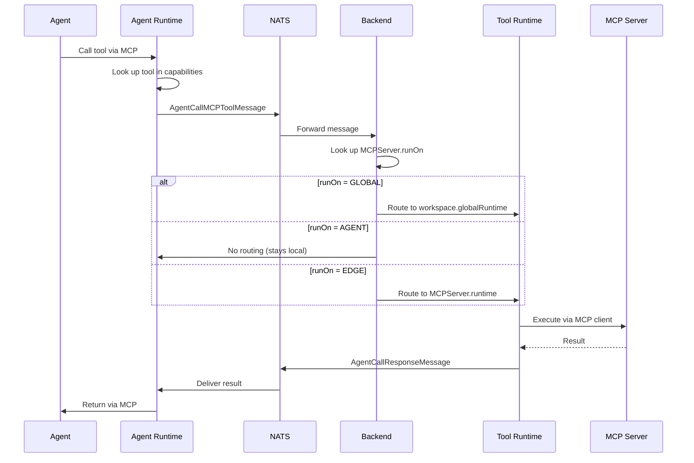

When an agent calls a tool, 2LY routes the execution request to the appropriate runtime based on the MCP server's `runOn` configuration. This page explains the complete routing flow.

## Tool Execution Flow



## Routing Decision

The routing decision is based on `MCPServer.runOn`:

### GLOBAL Routing

**Configuration:**
```graphql
mutation {
  createMCPServer(
    runOn: GLOBAL
    ...
  )
}
```

**Routing Logic:**
1. Backend looks up `workspace.globalRuntime`
2. Routes `AgentCallMCPToolMessage` to global runtime
3. Global runtime executes tool
4. Result returned to agent runtime

**Use Cases:**
- Shared tools (GitHub API, public databases)
- Stateless operations
- Tools that all agents should access

**Example:**
```
Agent A → Tool "github_search" → Global Runtime → GitHub MCP Server
Agent B → Tool "github_search" → Global Runtime → GitHub MCP Server
(Same server instance)
```

### AGENT Routing

**Configuration:**
```graphql
mutation {
  createMCPServer(
    runOn: AGENT
    ...
  )
}
```

**Routing Logic:**
1. Backend detects `runOn = AGENT`
2. No routing performed - stays on agent runtime
3. Agent runtime executes tool locally
4. Result returned directly

**Use Cases:**
- Agent-specific context or state
- Session-based tools
- Tools that follow agent deployment

**Example:**
```
Agent A → Tool "session_context" → Agent A's Runtime → Context MCP Server A
Agent B → Tool "session_context" → Agent B's Runtime → Context MCP Server B
(Different server instances)
```

### EDGE Routing

**Configuration:**
```graphql
mutation {
  createMCPServer(
    runOn: EDGE
    ...
  ) { id }
}

mutation {
  linkMCPServerToRuntime(
    mcpServerId: "..."
    runtimeId: "edge-runtime-id"
  )
}
```

**Routing Logic:**
1. Backend looks up `MCPServer.runtime`
2. Routes `AgentCallMCPToolMessage` to that runtime
3. Edge runtime executes tool
4. Result returned to agent runtime

**Use Cases:**
- User-specific tools (local filesystem, Docker)
- Machine-specific resources
- Sensitive operations on specific hardware

**Example:**
```
Agent A → Tool "docker_list" → Alice's Edge Runtime → Docker MCP Server
Agent B → Tool "docker_list" → Bob's Edge Runtime → Docker MCP Server
(Different machines, different Docker instances)
```

## Message Flow Details

### AgentCallMCPToolMessage

Sent from agent runtime to request tool execution:

```typescript
{
  from: "agent-runtime-rid",
  toolId: "tool-uuid",
  arguments: {
    // Tool-specific arguments
  }
}
```

**NATS Subject:**
```
agent-call-mcp-tool.{toolId}.{fromRuntimeId}
```

### AgentCallResponseMessage

Returned from tool runtime with result:

```typescript
{
  result: {
    content: [
      { type: "text", text: "result data" }
    ],
    isError: false
  }
}
```

## Tool Capability Assignment

Before an agent can call a tool, the tool must be in the runtime's capabilities:

### Assigning Capabilities

```graphql
mutation {
  linkMCPToolToRuntime(
    mcpToolId: "tool-id"
    runtimeId: "agent-runtime-id"
  )
}
```

This creates an edge: `Runtime --[mcpToolCapabilities]--> MCPTool`

### Capability Message

Backend publishes capabilities to agent runtime:

```typescript
// AgentCapabilitiesMessage
{
  capabilities: [
    {
      id: "tool-1-id",
      name: "read_file",
      description: "Read file contents",
      inputSchema: { /* JSON Schema */ }
    },
    {
      id: "tool-2-id",
      name: "github_search",
      ...
    }
  ]
}
```

**NATS Subject:**
```
agent-capabilities.{RID}
```

### Capability Check

When agent calls tool:

1. Agent runtime checks if tool is in capabilities list
2. If yes, routes via NATS
3. If no, returns error to agent

## Routing Examples

### Example 1: Filesystem Tool (GLOBAL)

**Setup:**
```graphql
mutation {
  createMCPServer(
    name: "Filesystem"
    command: "npx"
    args: "@modelcontextprotocol/server-filesystem /shared"
    runOn: GLOBAL
  )
}
```

**Flow:**
```
1. Agent calls "read_file"
2. Agent runtime → NATS
3. Backend routes to global runtime
4. Global runtime executes via filesystem MCP server
5. Result → Agent runtime → Agent
```

**Benefit:** All agents share same filesystem server instance.

### Example 2: Docker Tool (EDGE)

**Setup:**
```graphql
# Create server
mutation {
  createMCPServer(
    name: "Docker"
    command: "npx"
    args: "@modelcontextprotocol/server-docker"
    runOn: EDGE
  ) { id }
}

# Link to Alice's edge runtime
mutation {
  linkMCPServerToRuntime(
    mcpServerId: "docker-server-id"
    runtimeId: "alice-edge-runtime-id"
  )
}

# Assign tool to agent runtime
mutation {
  linkMCPToolToRuntime(
    mcpToolId: "docker-list-containers-id"
    runtimeId: "alice-agent-runtime-id"
  )
}
```

**Flow:**
```
1. Alice's agent calls "list_containers"
2. Agent runtime → NATS
3. Backend routes to Alice's edge runtime
4. Edge runtime executes via Docker MCP server
5. Lists containers on Alice's machine
6. Result → Agent runtime → Agent
```

**Benefit:** Alice's agent accesses her local Docker, isolated from others.

### Example 3: Session Tool (AGENT)

**Setup:**
```graphql
mutation {
  createMCPServer(
    name: "Session Context"
    command: "npx"
    args: "@example/session-context"
    runOn: AGENT
  )
}
```

**Flow:**
```
1. Agent calls "get_context"
2. Agent runtime (no NATS routing)
3. Agent runtime executes via local session MCP server
4. Returns agent-specific context
5. Result → Agent directly
```

**Benefit:** Each agent has its own session context, no cross-agent data.

## Routing Decision Matrix

| runOn Type | Where MCP Server Runs | When to Use | Example |
|------------|----------------------|-------------|---------|
| GLOBAL | workspace.globalRuntime | Shared, stateless tools | GitHub API, public databases |
| AGENT | Agent's runtime | Agent-specific, stateful | Session context, conversation history |
| EDGE | Specific runtime | User/machine-specific | Local filesystem, Docker, personal APIs |

## Performance Considerations

**GLOBAL:**
- Lowest latency for remote agents (no extra hop)
- Single MCP server instance
- Potential bottleneck for high load

**AGENT:**
- No routing overhead
- Higher memory usage (instance per agent)
- Best for low-latency requirements

**EDGE:**
- Network hop to edge runtime
- Isolated execution per user
- Good for resource-intensive tools

## Error Scenarios

### Tool Not Found
Agent calls tool not in capabilities:
```
Error: Tool "unknown_tool" not in capabilities
```

### Runtime Offline
Target runtime is INACTIVE:
```
Error: Runtime "edge-runtime" is offline
Timeout waiting for response
```

### MCP Server Crashed
Tool runtime's MCP server not running:
```
Error: MCP server "docker" not available
```

### Invalid Arguments
Tool call with wrong arguments:
```
Error: Invalid arguments for tool "read_file"
Missing required field: "path"
```

## Best Practices

**For Tool Configuration:**
- Use GLOBAL for shared, stateless tools
- Use AGENT for session-specific tools
- Use EDGE for user/machine-specific tools

**For Capability Assignment:**
- Only assign necessary tools to agents
- Use workspace-level filtering
- Review capabilities regularly

**For Monitoring:**
- Track tool execution latency by runOn type
- Monitor runtime health for EDGE runtimes
- Alert on routing timeouts

## Troubleshooting

**Tool calls timing out:**
- Check target runtime status (ACTIVE?)
- Verify NATS connectivity
- Review runtime logs
- Check MCP server subprocess is running

**Wrong tool result:**
- Verify runOn type is correct
- Check which runtime executed (logs)
- Ensure EDGE linkage is correct

**Tool not available:**
- Check tool status is ACTIVE
- Verify capability assignment
- Confirm MCP server is running
- Review AgentCapabilitiesMessage

## Next Steps

- [NATS Messaging](/technical-concepts/nats-messaging) - Understand message routing
- [Database Schema](/technical-concepts/database-schema) - Learn about runOn field
- [Runtime Implementation](/technical-concepts/runtime-implementation) - How runtimes execute tools