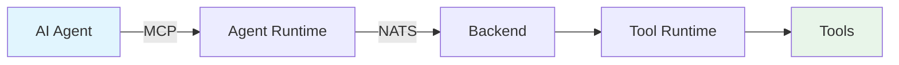

2LY solves tool fragmentation in AI development by providing a unified infrastructure for managing tools across any agent framework.

## Key Features

**Tool Registry** - Centralized catalog of MCP servers, APIs, and custom functions available to all agents

**Agents** - Connect any AI framework through MCP protocol to access your tool ecosystem

**Playground** - Test tools in real-time for debugging

**Deployment** - Distribute tools across local, cloud, or edge runtimes with flexible execution

**Monitoring** - Track agent-tool interactions amongst all your workflows

## How It Works

1. Agents connect as MCP clients through agent runtimes
2. Tool requests flow through NATS message bus
3. Backend routes to appropriate tool runtimes
4. Tools execute and return results

## Next Steps

1. [Install 2LY](/getting-started/installation)
2. [Quick Start](/getting-started/quick-start)
3. [Your First Toolflow](/your-first-toolflow/overview)

**Learn More:**
- [Core Concepts](/core-concepts/agents) - Agents, Tools, Runtime
- [Architecture](/getting-started/architecture) - System overview
